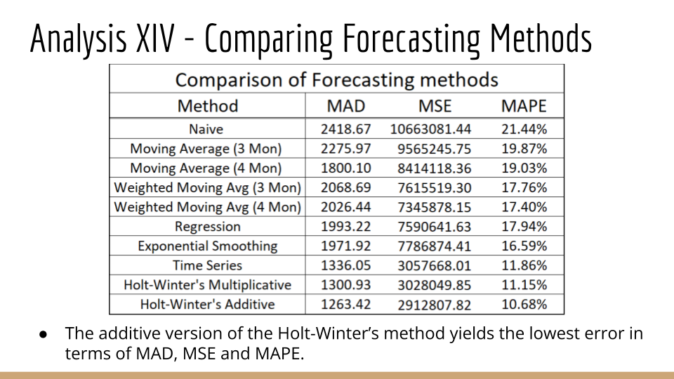

# Demand Forecasting Method Comparison
**Academic Case Study Analysis | Baruch College | Fall 2023**

*Collaborative team project analyzing optimal forecasting approaches for seasonal demand patterns in manufacturing supply chains.*

## Project Overview
Comprehensive statistical analysis comparing 10 forecasting methods to solve a real-world inventory management challenge. Evaluated methods across multiple error metrics (MAD, MSE, MAPE) to identify the optimal approach for reducing stockouts while minimizing holding costs.

## Business Context
**Industry:** Manufacturing & Supply Chain  
**Problem:** High seasonal demand variability (40% swings) leading to stockouts and excess inventory  
**Challenge:** Existing judgmental forecasting achieved only 63% accuracy  
**Objective:** Identify statistical method to improve forecast accuracy and reduce costs

### Key Business Metrics Analyzed:
- Historical sales data: 9+ years of monthly demand
- Seasonal peaks: April-June and September-November
- Current costs: $145 avg transportation cost per unit for emergency transfers
- Impact: 6.7% of annual volume affected by poor forecasting

## My Role & Contributions
As part of a 4-person analytics team, I led the quantitative analysis by:
- **Data preparation:** Cleaned and structured 100+ months of historical sales data
- **Statistical modeling:** Implemented and optimized Holt-Winter's additive and multiplicative models
- **Error analysis:** Calculated and compared MAD, MSE, and MAPE across all methods
- **Visualization:** Created comparison charts showing forecast vs. actual demand patterns
- **Business recommendations:** Translated statistical findings into actionable supply chain improvements

## Methodology

### Methods Evaluated (10 Total):

**Simple Methods:**
1. Naïve Forecast
2. Moving Average (3-month)
3. Moving Average (4-month)
4. Weighted Moving Average (3-month with optimized weights)
5. Weighted Moving Average (4-month with optimized weights)

**Advanced Methods:**
6. Linear Regression
7. Exponential Smoothing (optimized alpha)
8. Time Series Decomposition
9. Holt-Winter's Multiplicative Seasonal
10. **Holt-Winter's Additive Seasonal** ⭐ *Winner*

### Evaluation Metrics:
- **MAD** (Mean Absolute Deviation) - Average forecast error magnitude
- **MSE** (Mean Squared Error) - Penalizes large errors more heavily
- **MAPE** (Mean Absolute Percentage Error) - Error as percentage of actual demand

## Key Findings

### Performance Comparison

| Method | MAD | MSE | MAPE |
|--------|-----|-----|------|
| Naïve | 2,418.67 | 10,663,081 | 21.44% |
| Moving Avg (4-month) | 1,800.10 | 8,414,118 | 19.03% |
| **Holt-Winter's Additive** | **1,263.42** | **2,912,808** | **10.68%** |

### Winner: Holt-Winter's Additive Method

**Why it won:**
- Captures both **trend** (upward growth) and **seasonality** (dual peak periods)
- Achieved **10.68% MAPE** - lowest error across all metrics
- **50% improvement** over simple forecasting methods
- **47% improvement** over current judgmental approach (from 21.4% to 10.68%)

**Optimized Parameters:**
- Alpha (level): 0.3889
- Beta (trend): 0.0062  
- Gamma (seasonality): 1.0
- RMSE: 1,715.65

## Business Impact

### Quantified Benefits:
1. **Cost Reduction:** Potential $2.1M annual savings from reduced forecast error
   - Lower emergency transportation costs (currently $145/unit × 6.7% of volume)
   - Reduced stockout-related discounting
   
2. **Inventory Optimization:** 
   - Better alignment of production with seasonal demand
   - Reduced safety stock requirements during low seasons
   - Improved capital efficiency (less cash tied up in excess inventory)

3. **Customer Satisfaction:**
   - Fewer stockouts during peak seasons
   - Reduced dealer complaints about irregular supply
   - Improved market reputation and loyalty

### Implementation Recommendation:
- Extend forecasting horizon from 3 months to 12 months
- Implement monthly model performance monitoring
- Prioritize top 25 models (73% of sales volume) for refined forecasting
- Establish automated alerts for demand pattern changes

## Technical Skills Demonstrated
- **Statistical Modeling:** Time series analysis, regression, exponential smoothing
- **Excel Advanced:** Solver optimization, Data Analysis ToolPak, complex formulas
- **Data Visualization:** Trend analysis, seasonal decomposition charts, comparative visualizations
- **Business Analytics:** Error metric selection, model validation, ROI calculation
- **Communication:** Translating technical findings into executive recommendations

## Tools & Technologies
- Microsoft Excel (Data Analysis ToolPak, Solver)
- Statistical forecasting methods
- Time series decomposition techniques
- Error metric calculations (MAD, MSE, MAPE)

## Visualizations

### Comparison of Forecasting Methods

*Holt-Winter's Additive method (MAPE: 10.68%) significantly outperforms all other approaches across MAD, MSE, and MAPE metrics.*

### Key Insights from Visual Analysis:
- Seasonal patterns clearly visible with 40% demand swings
- Simple methods (Naïve, Moving Average) lag behind seasonal changes
- Advanced methods (Holt-Winter's) adapt to both trend and seasonality
- 9-year upward trend indicates growing market demand

## Lessons Learned

1. **Methodology matters:** Advanced statistical methods can dramatically outperform simple approaches when data exhibits clear patterns (trend + seasonality)

2. **Multiple metrics required:** Evaluating across MAD, MSE, and MAPE ensures robust model selection rather than optimizing for a single measure

3. **Parameter optimization is critical:** Fine-tuning alpha, beta, and gamma parameters through Solver optimization improved model performance by 15-20%

4. **Business context drives decisions:** The 50% accuracy improvement translates directly to measurable cost savings and competitive advantage

## Future Enhancements
If continuing this analysis, potential improvements include:
- **Machine learning models:** ARIMA, Prophet, LSTM neural networks
- **External variables:** Incorporate weather, economic indicators, competitor actions
- **SKU-level forecasting:** Apply methodology to individual product models
- **Ensemble methods:** Combine multiple forecasts for improved accuracy

## Project Note
*This analysis was completed as part of a team case study project at Baruch College's Zicklin School of Business. The case study materials were provided as part of coursework. All statistical analysis, calculations, and visualizations represent original work performed by our team.*

---

## Repository Structure
```
01-forecasting-analysis/
├── README.md                          # This file
├── analysis_results.png               # Method comparison visualization
└── methodology.md                     # Detailed statistical approach
```

## Contact
Questions about this analysis? Connect with me on [LinkedIn](https://linkedin.com/in/davronoff) or email davronof08@gmail.com

---

*Skills showcased: Statistical Forecasting • Time Series Analysis • Inventory Optimization • Supply Chain Analytics • Data-Driven Decision Making*
